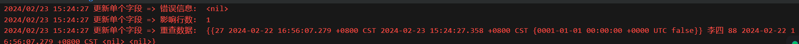
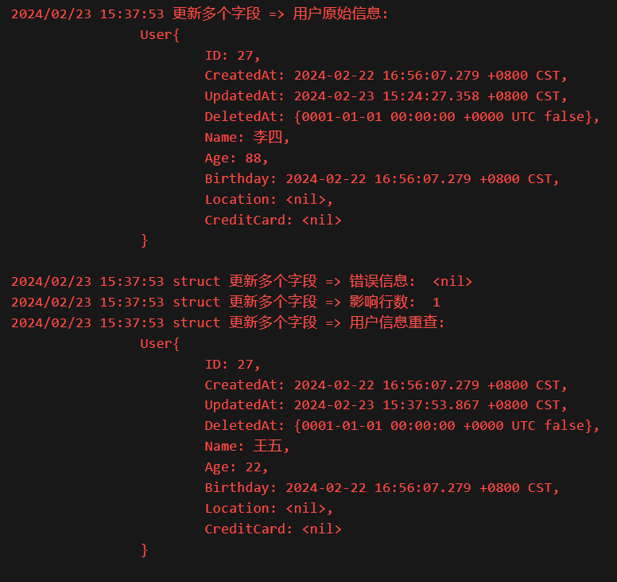
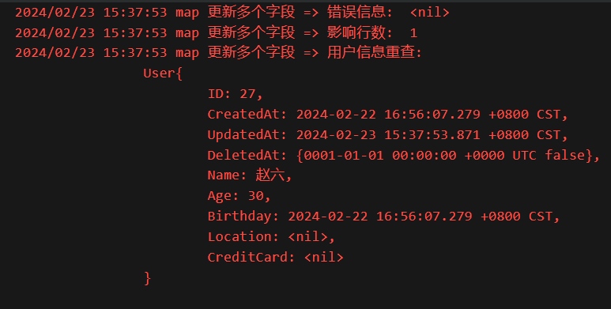
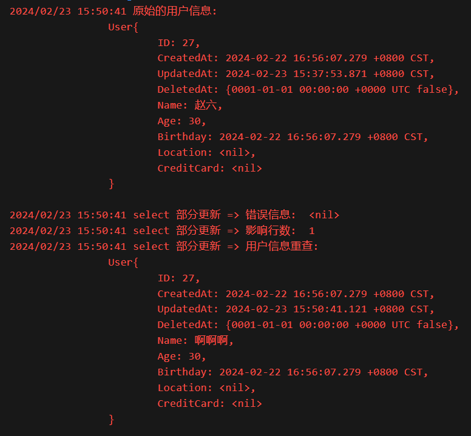
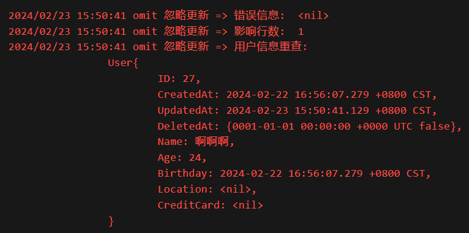
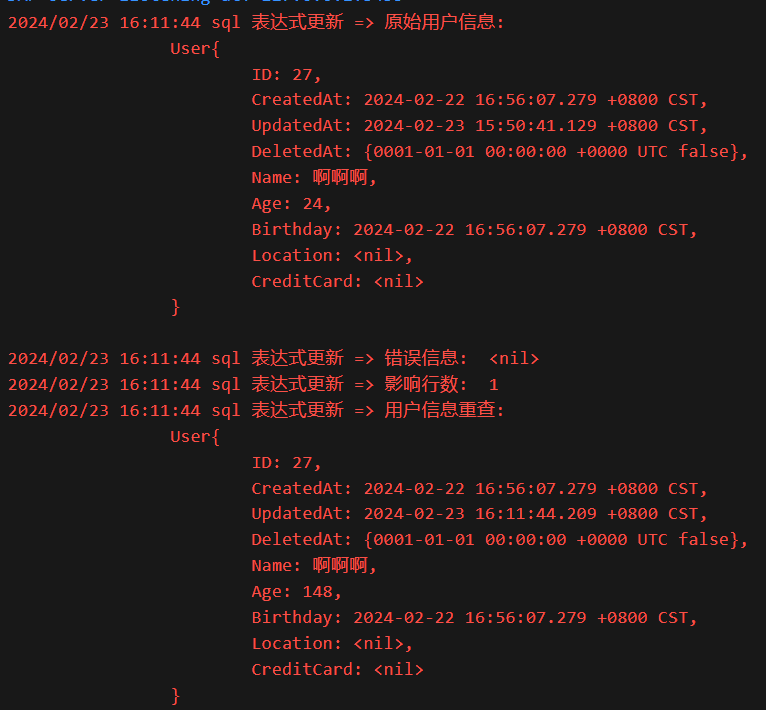
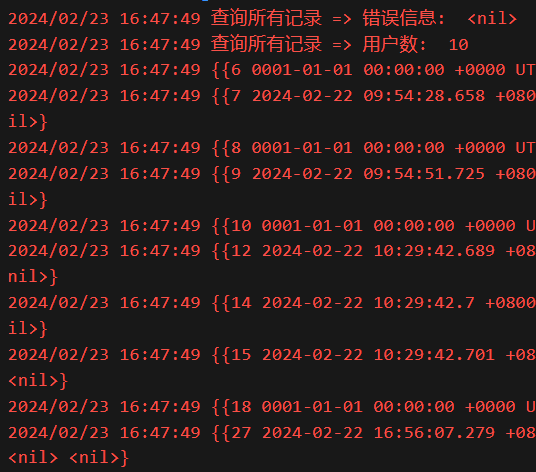
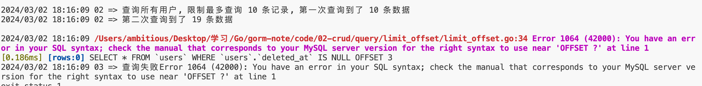
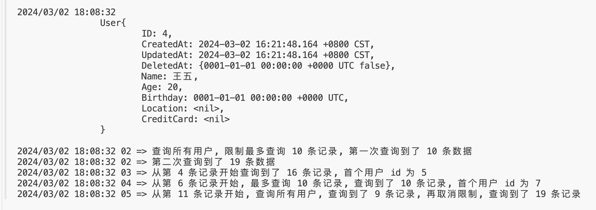

# GORM 学习笔记

> 文档地址：https://gorm.io/docs/
> 
> 仓库地址：https://github.com/AmbitiousJun/gorm-note

## 安装 & 快速入门 (QuickStart)

### 安装

需要安装两个库，分别是 gorm 和 mysql 数据库的驱动包

在终端中按顺序执行一下命令进行安装：

```shell
# gorm 库
go get -u gorm.io/gorm
# mysql 驱动包
go get -u gorm.io/driver/mysql
```

在编写程序之前，需要先创建一个 mysql 数据库，这里命名为 `gorm-learn`


无需创建表，gorm 提供了 API 可以方便地根据实体类生成相对应的表结构

接下来就是编写程序连接 mysql 进行增删改查操作了，首先建好一个 main.go 文件，写好一个空的 main 函数

### 连接

首先是连接数据库，使用 `gorm.Open()` 函数打开连接，接收两个参数，第一个是**数据库连接驱动**，第二个是**定制化配置**

要连接 mysql 数据库，就使用 mysql 驱动，即调用 `mysql.Open()` 函数，传入数据库连接 url 即可

不需要定制化配置，就传递一个空结构体

连接成功之后，可以获取到一个 `*gorm.DB` 类型的对象，这是用于操作数据库的核心对象

```go
// 1 初始化数据库
db, err := gorm.Open(mysql.Open("root:123456@tcp(127.0.0.1:3306)/gorm-learn?charset=utf8mb4&parseTime=True&loc=Local"), &gorm.Config{})
if err != nil {
    log.Fatalln("failed to connect database")
}
```

### 自动生成表结构

使用 gorm 不需要手动建表，只需要在代码中维护好结构体的属性即可，下面定义一个 `Product` 结构体：

```go
type Product struct {
    gorm.Model
    Code  string
    Price uint
}
```

gorm 提供了一个基础的结构体 `gorm.Model` ，包含了主键 (ID)、创建时间 (CreateAt)、更新时间 (UpdateAt)、删除时间 (DeleteAt) 等信息，可以直接将其**组合**到自定义的结构体下

调用 `db.AutoMigrate` 方法就可以很方便地创建表结构，表名是小写的结构体名称加上 s，例如现在这个结构体会自动生成 `products` 表

```go
// 2 自动创建数据库
db.AutoMigrate(&Product{})
```

### 新增

调用方法：`db.Create()`

```go
db.Create(&Product{Code: "D42", Price: 100})
```

### 查询

调用方法：`db.First()`

传入单个参数时，gorm 会去自动匹配主键字段进行查询

传入两个参数时，gorm 会将第一个参数作为预编译 sql，第二个参数作为 sql 中的数据值进行查询

```go
var product Product
// 4 根据主键查询数据
db.First(&product, 1)
log.Printf("根据主键 %d 查询到记录: %v\n", 1, product)

// 5 根据条件查询数据
db.First(&product, "code = ?", "D42")
log.Printf("根据条件 %s 查询到记录: %v\n", "code = D42", product)
```

### 修改

调用方法：`db.Model().Update()` | `db.Model().Updates`

首先通过 `Model` 方法指定要更新哪条记录

接着链式调用 `Update[s]` 方法进行更新

`Update` 方法用于更新单个字段，接收两个参数，分别是字段名和字段值 

`Updates` 方法用于更新多个字段，接收一个参数，只能是 **struct** 和 **map** 类型

```go
// 6 将当前记录的价格修改为 200
db.Model(&product).Update("Price", 200)
db.First(&product, 1)
log.Printf("将 Price 修改为 %d: %v\n", 200, product)

// 7 使用 struct 一次性修改多个字段
db.Model(&product).Updates(Product{Price: 300, Code: "F42"})
db.First(&product, 1)
log.Printf("使用 struct 一次性修改多个字段: %v\n", product)

// 8 使用 map 一次性修改多个字段
db.Model(&product).Updates(map[string]interface{}{"Price": 400, "Code": "G42"})
db.First(&product, 1)
log.Printf("使用 map 一次性修改多个字段: %v\n", product)
```

### 删除

调用方法：`db.Delete()`

传入要删除记录的主键值即可删除对应的记录

> gorm 会自动检测表中是否有 `DeleteAt` 属性，有的话在删除的时候就会采用逻辑删除模式，给 `DeleteAt` 属性设置值，而不实际删除记录
> 
> 在查询时，同样地会去检查当前字段是否为空，不为空则认为记录不存在
> 
> 由于 Product 结构体组合了 gorm 提供的 Model 结构，Model 结构中包含了 `DeleteAt` 属性，所以会自动采用逻辑删除模式

```go
// 9 根据主键删除记录
db.Delete(&product, 1)
```

### 完整代码

```go
package main

import (
    "log"

    "gorm.io/driver/mysql"
    "gorm.io/gorm"
)

type Product struct {
    gorm.Model
    Code  string
    Price uint
}

func main() {
    // 1 初始化数据库
    db, err := gorm.Open(mysql.Open("root:123456@tcp(127.0.0.1:3306)/gorm-learn?charset=utf8mb4&parseTime=True&loc=Local"), &gorm.Config{})
    if err != nil {
        log.Fatalln("failed to connect database")
    }

    // 2 自动创建数据库
    db.AutoMigrate(&Product{})

    // 3 创建一条记录
    db.Create(&Product{Code: "D42", Price: 100})

    var product Product
    // 4 根据主键查询数据
    db.First(&product, 1)
    log.Printf("根据主键 %d 查询到记录: %v\n", 1, product)

    // 5 根据条件查询数据
    db.First(&product, "code = ?", "D42")
    log.Printf("根据条件 %s 查询到记录: %v\n", "code = D42", product)

    // 6 将当前记录的价格修改为 200
    db.Model(&product).Update("Price", 200)
    db.First(&product, 1)
    log.Printf("将 Price 修改为 %d: %v\n", 200, product)

    // 7 使用 struct 一次性修改多个字段
    db.Model(&product).Updates(Product{Price: 300, Code: "F42"})
    db.First(&product, 1)
    log.Printf("使用 struct 一次性修改多个字段: %v\n", product)

    // 8 使用 map 一次性修改多个字段
    db.Model(&product).Updates(map[string]interface{}{"Price": 400, "Code": "G42"})
    db.First(&product, 1)
    log.Printf("使用 map 一次性修改多个字段: %v\n", product)

    // 9 根据主键删除记录
    db.Delete(&product, 1)
    db.First(&product, 1)
    log.Printf("删除记录后的查询结果: %v\n", product)
}
```

### 运行结果


## 模型定义 (Declaring Models)

在 Go 语言中，可以用结构体 (struct) 来定义模型，下面是一个 `User` 模型示例：

```go
type User struct {
    ID           uint           // Standard field for the primary key
    Name         string         // A regular string field
    Email        *string        // A pointer to a string, allowing for null values
    Age          uint8          // An unsigned 8-bit integer
    Birthday     *time.Time     // A pointer to time.Time, can be null
    MemberNumber sql.NullString // Uses sql.NullString to handle nullable strings
    ActivatedAt  sql.NullTime   // Uses sql.NullTime for nullable time fields
    CreatedAt    time.Time      // Automatically managed by GORM for creation time
    UpdatedAt    time.Time      // Automatically managed by GORM for update time
}
```

`User` 模型中，不同的属性使用了不同的类型进行存储，不同类型的含义如下：

- `uint`, `string`, `uint8` 等**基础类型**直接使用即可，无特殊含义

- `*string`, `*time.Time` 等**指针类型**也是支持的，表示该字段可以为空

- `sql.NullString`, `sql.NullTime` 类型（位于 database/sql 包下）也是用于表示可以为空的字段，并且提供了一些额外的特性

- `CreatedAt` 和 `UpdatedAt` 是 gorm 默认的特殊字段，用于在记录创建和更新的时候自动生成当前的时间

### 特殊字段

gorm 默认指定了一些具有特殊功能的字段，上文所说的 `CreatedAt` 和 `UpdatedAt` 字段就是其中之一

如果能够遵循 gorm 默认的规定进行开发，就可以省去很多的自定义配置工作，下面是对特殊字段及其功能的总结：

1. **主键**：对于每个模型，gorm 将名称为 `ID` 的字段认为是默认的主键

2. **表名**：在 Go 中，结构体通常定义为**大写驼峰**形式，gorm 在将结构体转换成表结构时，会自动将其转换为**小写下划线**格式，并且会携带复数形式。例如：结构体 `User` 映射到数据库表会变成 `users`

3. **字段名**：跟表名一致的规则

4. **时间戳字段**：默认情况下，只要结构体包含属性 `CreatedAt` 或者 `UpdatedAt` ，gorm 就会自动在记录创建或者更新时自动设置这两个字段为当前时间

### 基础模型

gorm 预定义了一个导出的结构体 `gorm.Model` ，包含一些通用的属性

```go
// gorm.Model definition
type Model struct {
    ID        uint           `gorm:"primaryKey"`
    CreatedAt time.Time
    UpdatedAt time.Time
    DeletedAt gorm.DeletedAt `gorm:"index"`
}
```

这个结构体中的属性都是具有特殊功能的，可以直接将其**嵌入**到自定义结构体中使用

```go
type Product struct{
    gorm.Model
    Price uint
    Code  string
}
```

> Go 语言不能像其他语言一样通过继承来扩展类的功能，官方更推荐的做法是将要扩展的结构体**组合**到新结构体下，作为一个匿名的属性，对应到这里所说的嵌入

### 属性级别的权限控制

默认情况下，gorm 拥有对结构体中的导出属性操作的所有权限，可以通过指定的 tag 来限制这个权限

> 注：这里的权限限制的是 gorm 框架，而不是操作数据库的用户

这里先简单贴出官方的示例结构体代码，详细的 tag 含义看之后的表格总结

```go
type User struct {
    Name string `gorm:"<-:create"`          // allow read and create
    Name string `gorm:"<-:update"`          // allow read and update
    Name string `gorm:"<-"`                 // allow read and write (create and update)
    Name string `gorm:"<-:false"`           // allow read, disable write permission
    Name string `gorm:"->"`                 // readonly (disable write permission unless it configured)
    Name string `gorm:"->;<-:create"`       // allow read and create
    Name string `gorm:"->:false;<-:create"` // createonly (disabled read from db)
    Name string `gorm:"-"`                  // ignore this field when write and read with struct
    Name string `gorm:"-:all"`              // ignore this field when write, read and migrate with struct
    Name string `gorm:"-:migration"`        // ignore this field when migrate with struct
}
```

### 嵌入结构体

有时候会出现在一个结构体中嵌入另一个自定义结构体的情况，但是数据都在同一张表上，并没有层级关系，这时就可以指明属性是嵌入结构体，这样子结构体在映射到数据库的时候就会被 “展开”。

#### 匿名子结构体

gorm 会自动将匿名子结构体认为是嵌入结构体，无需额外设置：

```go
type User struct {
    gorm.Model
    Name string
}

// equals
type User struct {
    ID        uint           `gorm:"primaryKey"`
    CreatedAt time.Time
    UpdatedAt time.Time
    DeletedAt gorm.DeletedAt `gorm:"index"`
    Name      string
}
```

#### 具名子结构体

可以通过 `embedded` tag 将一个具名子结构体指定为嵌入结构体：

```go
type Author struct{
    Name  string
    Email string
}


type Blog struct{
    ID      int
    Author  Author `gorm:"embedded"`
    Upvotes int32
}

// equals
type Blog struct{
    ID      int64
    Name    string
    Email   string
    Upvotes int32
}
```

#### 嵌入前缀

可以给嵌入结构体指定一个嵌入前缀，用于在数据库表中区分层级关系：

```go
type Author struct{
    Name  string
    Email string
}


type Blog struct{
    ID      int
    Author  Author `gorm:"embedded;embeddedPrefix:author_"`
    Upvotes int32
}

// equals
type Blog struct{
    ID            int64
    AuthorName    string
    AuthorEmail   string
    Upvotes       int32
}
```

#### 属性 tag 汇总

| tag 名称                 | 描述                                                                                            |
| ---------------------- | --------------------------------------------------------------------------------------------- |
| column                 | 自定义属性对应到数据库的名称                                                                                |
| type                   | 列的数据库类型，可指定多个，用空格分隔开。类似于数据库定义表结构的语句，例如：`MEDIUMINT UNSIGNED NOT NULL AUTO_INCREMENT`           |
| serializer             | 指定序列化器，用于将数据序列化到数据库中。例如：`serializer:json/gob/unixtime`                                        |
| size                   | 指定列大小。例如：`size:256`                                                                           |
| primaryKey             | 指定列为主键                                                                                        |
| unique                 | 指定列唯一                                                                                         |
| default                | 指定列的默认值                                                                                       |
| precision              | 指定列的精度                                                                                        |
| scale                  | 指定列的规模                                                                                        |
| not null               | 指定列不为空                                                                                        |
| autoIncrement          | 指定列自增                                                                                         |
| autoIncrementIncrement | 指定列跳步自增                                                                                       |
| embedded               | 指定属性为嵌入结构体                                                                                    |
| embeddedPrefix         | 嵌入结构体的列名前缀                                                                                    |
| autoCreateTime         | 指定列值为记录的创建时间，如果是 `int` 类型的字段，自动转换为 unix 时间戳，也可以自定义为 `nano/milli` 时间戳。例如：`autoCreateTime:nano` |
| autoUpdateTime         | 自定列值为记录的更新时间，特性与 `autoCreateTime` 一致                                                          |
| index                  | 创建索引                                                                                          |
| uniqueIndex            | 创建唯一索引                                                                                        |
| check                  | 创建约束。例如：`check:age > 13`                                                                      |
| <-                     | 设置列的`写`权限。`<-:create` 为只创建，`<-:update` 为只更新，`<-:false` 无写权限，`<-` 创建和更新权限                      |
| ->                     | 设置列的`读`权限。`->:false` 无读权限                                                                     |
| -                      | 忽略当前列。`-` 无读写权限，`-:migration` 无自动创建权限，`-:all` 无读写、自动创建权限                                      |
| comment                | 在自动创建表时给列增加注释                                                                                 |

## 增删改查

> 为了避免在学习时编写过多的重复代码，从这里开始将获取数据库连接信息、模型定义部分代码提取到一个 `db` 包下，并利用 `sync.Once` 实现单次初始化，使用时直接调用 `db.DB()` 即可获取到数据库操作对象
> 
> ```go
> // 统一的 database 管理
> package db
> 
> import (
>     "log"
>     "sync"
> 
>     "gorm.io/driver/mysql"
>     "gorm.io/gorm"
> )
> 
> var db *gorm.DB
> var initOnce sync.Once
> 
> func DB() *gorm.DB {
>     initOnce.Do(func() {
>         d, err := gorm.Open(mysql.Open("root:123456@tcp(127.0.0.1:3306)/gorm-learn?charset=utf8mb4&parseTime=True&loc=Local"))
>         if err != nil {
>             log.Fatal("failed to connect database")
>         }
>         db = d
>     })
>     return db
> }
> ```

### 新增 (Create)

> 相关模型定义：
> 
> ```go
> type User struct {
>     gorm.Model
>     Name     string
>     Age      int
>     Birthday time.Time
> }
> func (u *User) String() string {
>     return fmt.Sprintf(`
>         User{
>             ID: %v,
>             CreatedAt: %v,
>             UpdatedAt: %v,
>             DeletedAt: %v,
>             Name: %v,
>             Age: %v,
>             Birthday: %v
>         }
>     `, u.ID, u.CreatedAt, u.UpdatedAt, u.DeletedAt, u.Name, u.Age, u.Birthday)
> }
> ```

#### 1. 新增单条记录

调用方法：`Create()`

描述：实例化一个模型结构体，将其指针传递给 `Create()` 即可，方法返回一个 `result` 对象，可以获取到操作数据库的影响行数和错误信息，同时，新记录的主键值也会被回写到模型实例中

```go
// 1 创建 user, 获取主键以及操作结果
user := db.User{Name: "Jinzhu", Age: 18, Birthday: time.Now()}
result := db.DB().Create(&user)
log.Println("新增用户的 ID: ", user.ID)
log.Println("新增时的错误: ", result.Error)
log.Println("新增时的数据库影响行数: ", result.RowsAffected)
```

#### 2. 新增多条记录

调用方法：`Create()`

描述：实例化一个模型结构体切片，再将切片传递给 `Create()` 即可

```go
// 2 批量新增 user
users := []*db.User{
    {Name: "Jinzhu", Age: 18, Birthday: time.Now()},
    {Name: "Jackson", Age: 19, Birthday: time.Now()},
}
result = db.DB().Create(users)
ids := []string{}
for _, user := range users {
    ids = append(ids, fmt.Sprintf("%v", user.ID))
}
log.Printf("批量新增的用户 Id: %s", strings.Join(ids, ", "))
log.Println("批量新增时的错误: ", result.Error)
log.Println("批量新增时的数据库影响行数: ", result.RowsAffected)
```

#### 3. 指定插入特定的字段

调用方法：`Select().Create()`

描述：指定新增时要插入哪些字段值

```go
// 1 指定插入特定的字段
// INSERT INTO `users` (`name`,`age`,`created_at`) VALUES ("jinzhu", 18, "2020-07-04 11:05:21.775")
user := db.User{Name: "John", Age: 19, Birthday: time.Now()}
result := d.Select("Name", "Age", "CreatedAt").Create(&user)
log.Println("指定插入特定字段 => 错误信息: ", result.Error)
log.Println("指定插入特定字段 => 影响行数: ", result.RowsAffected)
d.First(findUser, user.ID)
log.Println("指定插入特定字段 => 新增结果: ", findUser)
```


#### 4. 指定不插入特定的字段

调用方法：`Omit().Create()`

描述：指定新增时不插入哪些字段值

```go
// 2 指定不插入特定字段
// INSERT INTO `users` (`birthday`,`updated_at`) VALUES ("2020-01-01 00:00:00.000", "2020-07-04 11:05:21.775")
user.ID = 0
result = d.Omit("Name", "Age", "CreatedAt").Create(&user)
log.Println("指定不插入特定字段 => 错误信息: ", result.Error)
log.Println("指定不插入特定字段 => 影响行数: ", result.RowsAffected)
findUser = new(db.User)
d.First(findUser, user.ID)
log.Println("指定不插入特定字段 => 新增结果: ", findUser)
```


#### 5. 批量插入

调用方法：`CreateInBatches()`

描述：传递切片进行创建，可以指定每次插入几条数据，分批次插入

```go
users := []db.User{
    {Name: "ZhangSan", Age: 18},
    {Name: "LiSi", Age: 19},
    {Name: "WangWu", Age: 20},
    {Name: "ZhaoLiu", Age: 21},
    {Name: "TianQi", Age: 22},
}

// 一次插入 2 条数据
result := d.Omit("Birthday").CreateInBatches(users, 2)
log.Println("批量插入数据 => 错误信息: ", result.Error)
log.Println("批量插入数据 => 影响行数: ", result.RowsAffected)
```


#### 6. 钩子

通过给模型绑定特定的钩子，就可以实现在创建记录的不同时期执行特殊的操作，分别有：

```go
// 在更新或创建之前触发，返回错误则事务回滚
func (u *User) BeforeSave(tx *gorm.DB) (err error)
// 在创建之前触发，返回错误则事务回滚
func (u *User) BeforeCreate(tx *gorm.DB) (err error)
// 在创建之后触发，返回错误则事务回滚
func (u *User) AfterCreate(tx *gorm.DB) (err error)
// 在更新或创建之后触发，返回错误则事务回滚
func (u *User) AfterSave(tx *gorm.DB) (err error)
```

官方给出的例子，在创建记录之前校验用户信息：

```go
func (u *User) BeforeCreate(tx *gorm.DB) (err error) {
    u.UUID = uuid.New()

    if !u.IsValid() {
      err = errors.New("can't save invalid data")
    }
    return
}
```

定义了钩子之后，如果有某个需求需要跳过钩子，不执行，则需要使用 `SkipHooks` 模式：

```go
db.Session(&gorm.Session{SkipHooks: true}).Create(&user)
```

#### 7. 通过 map 新增

调用方法：`Model().Create()`

描述：先用 `Model()` 指定要操作哪个模型（表），再调用 `Create()` 传入 map 实例来新增记录，也可以传入 map 类型的切片，批量新增记录

```go
// 1 创建单条记录
result := d.Model(&db.User{}).Create(map[string]interface{}{
    "Name": "Johnny",
    "Age":  18,
})
log.Println("map 创建单条记录 => 错误信息: ", result.Error)
log.Println("map 创建单条记录 => 影响行数: ", result.RowsAffected)

// 2 创建多条记录
result = d.Model(&db.User{}).Create([]map[string]interface{}{
    {"Name": "aaa", "Age": 20},
    {"Name": "bbb", "Age": 21},
})
log.Println("map 创建多条记录 => 错误信息: ", result.Error)
log.Println("map 创建多条记录 => 影响行数: ", result.RowsAffected)
```


#### 8. 新增时使用 SQL 表达式设置字段

例子：在 `User` 结构体中额外定义了一个 `Location` 字段，用于记录地理横纵坐标，现在要将其和 MySQL 的 `geometry` 类型关联起来

`Location` 结构体的定义如下：

```go
type Location struct {
    X, Y int
}
```

通过给 `Location` 绑定 3 个方法实现关联，分别是：

- `Scan` : 实现了 `sql.Scanner` 接口，作用是将数据库返回的数据解析到 Location 中

- `GormDataType` : 实现了 `schema.GormDataTypeInterface` 接口，作用是告诉 gorm 该类型对应到数据库的什么类型

- `GormValue`: 实现了 `gorm.Valuer` 接口，作用是告诉 gorm 如何将 Location 的值储存到数据库中的对应类型下

```go
// Scan 实现 sql.Scanner 接口, 用于将数据库数据转换为自定义结构
func (l *Location) Scan(v interface{}) error {
    var bytes []byte
    var ok bool
    if bytes, ok = v.([]byte); !ok {
        return errors.New("数据库返回错误的格式")
    }
    reg := `POINT\((\d+) (\d+)\)`
    exp := regexp.MustCompile(reg)
    results := exp.FindStringSubmatch(string(bytes))
    if len(results) != 3 {
        return errors.New("解析数据库返回结果失败")
    }
    l.X, _ = strconv.Atoi(results[1])
    l.Y, _ = strconv.Atoi(results[2])
    return nil
}

// GormDataType 实现 schema.GormDataTypeInterface 接口, 指定结构体匹配的数据库类型
func (l *Location) GormDataType() string {
    return "geometry"
}

// GormValue 实现 gorm.Valuer 接口, 指定结构体数据应该怎么储存到数据库中
func (l *Location) GormValue(ctx context.Context, db *gorm.DB) clause.Expr {
    return clause.Expr{
        SQL:  "ST_PointFromText(?)",
        Vars: []interface{}{fmt.Sprintf("POINT(%d %d)", l.X, l.Y)},
    }
}
```

使用自定义的 SQL 表达式插入记录：

```go
// 创建一条带有 Location 属性的记录
user := db.User{
    Name:     "Haha",
    Age:      30,
    Birthday: time.Now(),
    Location: &db.Location{X: 33, Y: 44},
}
result := d.Create(&user)
log.Println("通过 SQL 表达式创建 => 错误信息: ", result.Error)
log.Println("通过 SQL 表达式创建 => 影响行数: ", result.RowsAffected)

// 查询
var findUser = new(db.User)
d.Raw("select id, created_at, updated_at, deleted_at, name, age, birthday, ST_AsText(location) as location from users where id = ?", user.ID).Scan(&findUser)
log.Println("通过 SQL 表达式创建 => 重查结果: ", findUser)
```

> 注：这里需要自己手写 SQL 来将数据库中的 geometry 字段查询成普通文本


#### 9. 关联新增

在一个模型中嵌套另一个模型，对应于数据库中一对一和一对多场景。

**注意点**：嵌套的模型需要有一个外层模型 ID 属性，例如外层模型是 User，那么嵌套模型就需要有一个 `UserID` 属性（只针对采用 gorm 默认配置的情况下）

```go
type User struct {
    gorm.Model
    Name       string
    Age        int
    Birthday   time.Time
    Location   *Location
    CreditCard *CreditCard
}
type CreditCard struct {
    gorm.Model
    Number string
    UserID uint
}
```

#### 10. 插入或更新时的冲突处理

调用方法：`Clauses(clause.OnConflict{}).Create()`

描述：当要修改的某个字段与数据库原有字段冲突（主键已存在、唯一索引冲突）时，可以指定冲突处理方式

```go
user := db.User{Name: "Sarra", Age: 30}

// 1 忽略冲突
d.Clauses(clause.OnConflict{DoNothing: true}).Create(&user)

// 2 当字段 id 冲突时，修改指定字段为默认值
// MERGE INTO "users" USING *** WHEN NOT MATCHED THEN INSERT *** WHEN MATCHED THEN UPDATE SET ***; SQL Server
// INSERT INTO `users` *** ON DUPLICATE KEY UPDATE ***; MySQL
d.Clauses(clause.OnConflict{
    Columns:   []clause.Column{{Name: "id"}},
    DoUpdates: clause.Assignments(map[string]interface{}{"role": "user"}),
}).Create(&user)

// 3 当字段 id 冲突时，使用 SQL 生成指定字段值
// INSERT INTO `users` *** ON DUPLICATE KEY UPDATE `count`=GREATEST(count, VALUES(count));
d.Clauses(clause.OnConflict{
    Columns:   []clause.Column{{Name: "id"}},
    DoUpdates: clause.Assignments(map[string]interface{}{"count": gorm.Expr("GREATEST(count, VALUES(count))")}),
}).Create(&user)

// 4 当字段 id 冲突时，将指定字段更新为新值
// MERGE INTO "users" USING *** WHEN NOT MATCHED THEN INSERT *** WHEN MATCHED THEN UPDATE SET "name"="excluded"."name"; SQL Server
// INSERT INTO "users" *** ON CONFLICT ("id") DO UPDATE SET "name"="excluded"."name", "age"="excluded"."age"; PostgreSQL
// INSERT INTO `users` *** ON DUPLICATE KEY UPDATE `name`=VALUES(name),`age`=VALUES(age); MySQL
d.Clauses(clause.OnConflict{
    Columns:   []clause.Column{{Name: "id"}},
    DoUpdates: clause.AssignmentColumns([]string{"name", "age"}),
}).Create(&user)

// 5 当字段 id 冲突时，将除了主键之外的全部字段进行更新
d.Clauses(clause.OnConflict{UpdateAll: true}).Create(&user)
// INSERT INTO "users" *** ON CONFLICT ("id") DO UPDATE SET "name"="excluded"."name", "age"="excluded"."age", ...;
// INSERT INTO `users` *** ON DUPLICATE KEY UPDATE `name`=VALUES(name),`age`=VALUES(age), ...; MySQL
```

### 删除 (Delete)

#### 1. 基本删除

调用方法：`Delete()`

描述：直接传递实体到方法中，自动根据 id 字段进行删除，如果实体中包含 `DeletedAt` 属性，自动开启逻辑删除

```go
// 1 直接传递实体进行删除，自动根据 id 删除
result := d.Delete(&user)
log.Println("传递实体进行删除 => 错误信息: ", result.Error)
log.Println("传递实体进行删除 => 影响行数: ", result.RowsAffected)

// 2 自定义删除条件 + id
result = d.Where("name = ?", "ZhangSan").Delete(&user)
log.Println("自定义删除条件删除 => 错误信息: ", result.Error)
log.Println("自定义删除条件删除 => 影响行数: ", result.RowsAffected)
```

#### 2. 根据主键删除

调用方法：`Delete()`

描述：传递一个空实体到方法中，跟上要删除记录的主键值进行删除。主键值可以是 `int`, `string`, `slice` 类型

```go
// 1 传递 int 类型的主键值进行删除
result := d.Delete(&db.User{}, 1)
log.Println("传递 int 类型的主键值进行删除 => 错误信息: ", result.Error)
log.Println("传递 int 类型的主键值进行删除 => 影响行数: ", result.RowsAffected)

// 2 传递 string 类型的主键值进行删除
result = d.Delete(&db.User{}, "2")
log.Println("传递 string 类型的主键值进行删除 => 错误信息: ", result.Error)
log.Println("传递 string 类型的主键值进行删除 => 影响行数: ", result.RowsAffected)

// 3 传递 slice 类型的主键值进行批量删除
result = d.Delete(&db.User{}, []int{3, 4, 5})
log.Println("传递 slice 类型的主键值进行删除 => 错误信息: ", result.Error)
log.Println("传递 slice 类型的主键值进行删除 => 影响行数: ", result.RowsAffected)
```

#### 3. 钩子

类似新增，删除操作也可以为模型定义相应的钩子函数 `BeforeDelete` 和 `AfterDelete`

👇官方示例：在删除操作执行之前，判断用户如果是管理员角色就不允许删除

```go
func (u *User) BeforeDelete(tx *gorm.DB) (err error) {
    if u.Role == "admin" {
        return errors.New("admin user not allowed to delete")
    }
    return
}
```

#### 4. 批量删除

调用方法：`Delete()`

描述：在调用时传递一个不包含主键属性的实体即可自动进行批量删除

```go
// 传递一个不包含主键的实体，自动执行批量删除
result := d.Delete(&db.User{}, "name like ?", "%Haha%")
log.Println("批量删除 => 错误信息: ", result.Error)
log.Println("批量删除 => 影响行数: ", result.RowsAffected)
```

#### 5. 全局操作阻塞

gorm 默认不允许全局删除表中的记录，即删除时没有携带 where 条件的删除，可以通过以下 3 种方式绕过：

```go
// 调用删除方法时没有指定 where 条件会直接抛出异常
result := d.Delete(&db.User{})
log.Println("没有指定 where 条件 => 错误信息: ", result.Error)
log.Println("没有指定 where 条件 => 影响行数: ", result.RowsAffected)

// 绕过方式 1：指定一个永远为真的条件
result = d.Where("1 = 1").Delete(&db.User{})
log.Println("绕过方式 1 => 错误信息: ", result.Error)
log.Println("绕过方式 1 => 影响行数: ", result.RowsAffected)

// 绕过方式 2：执行原始 SQL
result = d.Exec("delete from users")
log.Println("绕过方式 2 => 错误信息: ", result.Error)
log.Println("绕过方式 2 => 影响行数: ", result.RowsAffected)

// 绕过方式 3：开启 AllowGlobalUpdate
result = d.Session(&gorm.Session{AllowGlobalUpdate: true}).Delete(&db.User{})
log.Println("绕过方式 3 => 错误信息: ", result.Error)
log.Println("绕过方式 3 => 影响行数: ", result.RowsAffected)
```

#### 6. 回写被删除的数据

调用方法：`Clauses(clause.Returning{}).Delete()`

描述：删除数据后，将被删除的数据回写到内存中。这个特性只有数据库支持了才会生效

```go
var users []db.User
result := d.Clauses(clause.Returning{
Columns: []clause.Column{{Name: "age"}, {Name: "name"}},
}).Delete(&users, "age in ?", []int{18, 20})
log.Println("删除时返回数据 => 错误信息: ", result.Error)
log.Println("删除时返回数据 => 影响行数: ", result.RowsAffected)
log.Println("删除时返回数据 => users: ", users)
```

#### 7. 逻辑删除 (Soft Delete)

当自定义模型组合了 `gorm.Model` 结构或者定义了一个 `gorm.DeletedAt` 类型的属性时，逻辑删除模式自动开启。如下面两个定义所示：

```go
type User struct {
    gorm.Model
    Name string
}


type User struct {
    ID      uint
    Name    string
    Deleted gorm.DeletedAt
}
```

**如何查询出已经被逻辑删除的记录？**

调用方法：`Unscoped().Find()`

示例：

```go
d.Unscoped().Where("age = 20").Find(&users)
// select * from users where age = 20;
```

**在已开启逻辑删除模式下，如何进行永久删除？**

调用方法：`Unscoped().Delete()`

示例：

```go
d.Unscoped().Delete(&user)
// delete from users where id = 10;
```

### 更新 (Update)

#### 1. 基本更新

调用方法：`Save()`

描述：将要修改的实体直接传递给 `Save` 方法即可，需要注意的是，若实体中的主键值不为空，则会更新实体的所有属性到数据库中；若实体中的主键值为空，则会执行新增操作。

```go
// 更新所有字段
var user = new(db.User)
d.First(user, 27)
log.Println("更新所有字段 => 查询出的用户原信息: ", *user)
user.Name = "李四"
user.Age = 99
result := d.Save(user)
log.Println("更新所有字段 => 错误信息: ", result.Error)
log.Println("更新所有字段 => 影响行数: ", result.RowsAffected)
d.First(user, 27)
log.Println("更新所有字段 => 修改后重新查询用户信息: ", *user)
```

#### 2. 更新单个字段

调用方法：`Model().Update()` | `Model(&User{}).Where().Update()`

描述：通过 `Model` 方法指定要更新哪个表的记录，再调用 `Update` 方法更新单个字段。需要注意的是，如果在更新时 gorm 检测不到 where 条件，会直接返回错误。使用第一种方式更新时，要确保传入 `Model` 的实体有主键值，否则需要使用第二种调用方式，手动指定 where 条件。

```go
// 使用自定义的 where 条件进行更新
result := d.Model(&db.User{}).Where("name = ?", "李四").Update("age", 88)
log.Println("更新单个字段 => 错误信息: ", result.Error)
log.Println("更新单个字段 => 影响行数: ", result.RowsAffected)
var findUser = new(db.User)
d.First(findUser, "name = ?", "李四")
log.Println("更新单个字段 => 重查数据: ", *findUser)
```



#### 3. 更新多个字段

调用方法：`Model().Updates()`

描述：可以将 `struct` 和 `map` 传入 `Updates` 方法中实现更新多个字段。使用 `struct` 进行更新时，gorm 只会扫描结构体中的 **非零值** 属性进行更新。

```go
var findUser = new(db.User)
d.First(findUser, 27)
log.Println("更新多个字段 => 用户原始信息: ", findUser)

// 1 使用 struct 更新
result := d.Model(findUser).Updates(db.User{Name: "王五", Age: 22})
log.Println("struct 更新多个字段 => 错误信息: ", result.Error)
log.Println("struct 更新多个字段 => 影响行数: ", result.RowsAffected)
d.First(findUser, 27)
log.Println("struct 更新多个字段 => 用户信息重查: ", findUser)

// 2 使用 map 更新
result = d.Model(findUser).Updates(map[string]interface{}{"name": "赵六", "age": 30})
log.Println("map 更新多个字段 => 错误信息: ", result.Error)
log.Println("map 更新多个字段 => 影响行数: ", result.RowsAffected)
d.First(findUser, 27)
log.Println("map 更新多个字段 => 用户信息重查: ", findUser)
```





#### 4. 部分字段更新

调用方法：`Model().Select().Updates()` | `Model().Omit().Updates()`

描述：通过 `Select` 和 `Omit` 两个方法实现部分字段更新

```go
var findUser = new(db.User)
d.First(findUser, 27)
log.Println("原始的用户信息: ", findUser)

// 1 select 部分更新
result := d.Model(findUser).Select("Name").Updates(db.User{Name: "啊啊啊", Age: 50})
log.Println("select 部分更新 => 错误信息: ", result.Error)
log.Println("select 部分更新 => 影响行数: ", result.RowsAffected)
d.First(findUser, 27)
log.Println("select 部分更新 => 用户信息重查: ", findUser)

// 2 omit 忽略更新
result = d.Model(findUser).Omit("Name").Updates(db.User{Name: "嗯嗯嗯", Age: 24})
log.Println("omit 忽略更新 => 错误信息: ", result.Error)
log.Println("omit 忽略更新 => 影响行数: ", result.RowsAffected)
d.First(findUser, 27)
log.Println("omit 忽略更新 => 用户信息重查: ", findUser)
```





#### 5. 钩子

gorm 支持为实体类绑定 4 个钩子方法，分别是 `BeforeSave`, `BeforeUpdate`, `AfterSave`, `AfterUpdate`

下面是官方示例：不允许更新 admin 用户的数据

```go
func (u *User) BeforeUpdate(tx *gorm.DB) (err error) {
    if u.Role == "admin" {
        return errors.New("admin user not allowed to update")
    }
    return
}
```

#### 6. 批量更新

调用方法：`Model().Where().Updates()`

描述：跟单个更新差别不大，构造一个查询结果不唯一的 where 条件即可实现批量更新

#### 7. 全局操作阻塞

更新操作跟删除操作一样，如果更新语句里面没有 where 条件，默认不允许更新

绕过方式与删除操作一致

#### 8. 使用 SQL 表达式更新

调用方法：`Model().Update(column, gorm.Expr())`

描述：使用 `gorm.Expr` 方法定义 SQL 表达式更新字段

```go
var findUser = new(db.User)
d.First(findUser, 27)
log.Println("sql 表达式更新 => 原始用户信息: ", findUser)

result := d.Model(findUser).Update("age", gorm.Expr("age * ? + ?", 2, 100))
log.Println("sql 表达式更新 => 错误信息: ", result.Error)
log.Println("sql 表达式更新 => 影响行数: ", result.RowsAffected)
d.First(findUser, 27)
log.Println("sql 表达式更新 => 用户信息重查: ", findUser)
```



### 查询 (Query)

#### 1. 基本查询

调用方法：`First()` | `Take()` | `Last()`

描述：三个方法都只能返回至多 1 条记录，并且当查询不到记录时，会返回 `gorm.ErrRecordNotFound` 错误。当模型没有定义主键时，`First` 和 `Last` 方法会自动根据模型的第 1 个属性进行排序

区别：

- `First`: 根据主键升序排序查询第 1 条记录
- `Take`: 不排序，查询第 1 条记录
- `Last`: 根据主键降序排序查询第 1 条记录

```go
// 1 查询 1 条记录, 根据主键升序排序
var findUser = new(db.User)
result := d.First(findUser)
if errors.Is(result.Error, gorm.ErrRecordNotFound) {
    log.Fatal("查询不到记录: ", result.Error)
} else {
    log.Println("First 查询 => 用户信息: ", findUser)
}

// 2 查询 1 条记录, 不排序
findUser = new(db.User)
result = d.Take(findUser)
if errors.Is(result.Error, gorm.ErrRecordNotFound) {
    log.Fatal("查询不到记录: ", result.Error)
} else {
    log.Println("Take 查询 => 用户信息: ", findUser)
}

// 3 查询 1 条记录, 根据主键降序排序
findUser = new(db.User)
result = d.Last(findUser)
if errors.Is(result.Error, gorm.ErrRecordNotFound) {
    log.Fatal("查询不到记录: ", result.Error)
} else {
    log.Println("Last 查询 => 用户信息: ", findUser)
}
```


#### 2. 根据主键进行查询

在 `crud` 章节的示例代码中，已经大量使用通过主键进行查询的方式，这里不再整理

#### 3. 查询所有记录

调用方法：`Find()`

描述：查询出所有符合条件的记录

```go
var users []db.User
result := d.Find(&users)
log.Println("查询所有记录 => 错误信息: ", result.Error)
log.Println("查询所有记录 => 用户数: ", len(users))
for _, user := range users {
    log.Println(user)
}
```



#### 4. 字符串形式的查询条件

调用方法：`Where().Find()`

描述：使用 `Where` 方法，编写字符串形式的查询条件

```go
var findUser = new(db.User)
var findUsers []db.User

// Equals
d.Where("name = ?", "jinzhu").First(findUser)

// Not Equals
d.Where("name <> ?", "jinzhu").Find(&findUsers)

// In
d.Where("name IN ?", []string{"jinzhu", "jinzhu_2"}).Find(&findUsers)

// Like
d.Where("name LIKE ?", "%jin%").Find(&findUsers)

// And
d.Where("name = ? AND age >= ?", "jinzhu", 22).Find(&findUsers)

lastWeek, today := time.Now().AddDate(0, 0, -7), time.Now()
// Time
d.Where("updated_ad > ?", lastWeek).Find(&findUsers)

// Between
d.Where("created_at BETWEEN ? AND ?", lastWeek, today).Find(&findUsers)
```

#### 5. 通过map、struct 构造查询条件

调用方法：`Where().Find()`

描述：同样是使用 `Where` 方法构造查询条件，不同的是参数传递的不再是字符串了，而是 `struct` 或者 `map`。需要注意的是，如果使用 `struct` 构造的查询条件，gorm 会忽略掉 **零值** 属性

```go
var findUsers []*db.User

// 1 使用 struct 构造条件
d.Where(&db.User{Name: "John", Age: 19}).Find(&findUsers)

// 2 使用 map 构造条件
d.Where(map[string]interface{}{"Name": "John", "Age": 19}).Find(&findUsers)

// 3 使用 slice 查询主键
d.Where([]int64{20, 21, 22}).Find(&findUsers)
```

**struct 构造条件扩展**

使用 `struct` 构造条件时，gorm 会默认忽略掉结构体中的零值属性，但我们可以继续传递参数到 `Where` 方法中，指定要用哪些属性来构造查询条件，参考以下例子：

```go
// select * from users where name = "jinzhu" and age = 0;
db.Where(&User{Name: "jinzhu"}, "name", "age").Find(&users)

// select * from users where age = 0;
db.Where(&User{Name: "jinzhu"}, "age").Find(&users)
```

#### 6. 内联查询条件

可以不借助 `Where` 方法，直接在 `Find` 方法之后继续拼接参数作为查询条件：

```go
db.First(&user, "id = ?", "string_primary_key")
db.Find(&user, "name = ?", "jinzhu")
db.Find(&users, "name <> ? and age > ?", "jinzhu", 20)
db.Find(&users, User{Age: 20})
db.Find(&users, map[string]interface{}{"age": 20})
```

#### 7. Not 查询条件

`Not` 查询条件与 `Where` 条件类似，只是在最终的 SQL 条件之前再加上 `NOT` 关键字

```go
// select * from users where NOT name = "jinzhu" order by id limit 1;
db.Not("name = ?", "jinzhu").First(&user)
// select * from users where name NOT in ("jinzhu", "jinzhu_2");
db.Not(map[string]interface{}{"name": []string{"jinzhu", "jinzhu_2"}})
// select * from users where name <> "jinzhu" and age <> 18 order by id;
db.Not(User{Name: "jinzhu", Age: 18}).First(&user)
// select * from users where id NOT in (1, 2, 3) order by id limit 1;
db.Not([]int64{1, 2, 3}).First(&user)
```

#### 8. Or 查询条件

例子：

```go
// select * from users where role = 'admin' or role = 'super_admin';
db.Where("role = ?", "admin").Or("role = ?", "super_admin").Find(&users)
// select * from users where name = 'jinzhu' or (name = 'jinzhu_2' and age = 18);
db.Where("name = 'jinzhu'").Or(User{Name: "jinzhu_2", Age: 18}).Find(&users)
// select * from users where name = 'jinzhu' or (name = 'jinzhu_2' and age = 18);
db.Where("name = 'jinzhu'").Or(map[string]interface{}{"name": "jinzhu_2", "age": 18}).Find(&users)
```

#### 9. Order 排序

描述：指定查询数据的排列顺序

例子：

```go
// select * from users order by age desc, name;
db.Order("age desc, name").Find(&users)

// select * from users order by age desc, name;
db.Order("age desc").Order("name").Find(&users)

// select * from users order by field(id, 1, 2, 3)
db.Clauses(clause.OrderBy{
    Expression: clause.Expr{
        SQL: "field(id,?)",
        Vars: []interface{}{[]int{1, 2, 3}},
        WithoutParentheses: true,
    }
}).Find(&User{})
```

#### 10. Limit & Offset

描述：`Limit()` 方法可以限制查询时 **最多查询多少条记录** ，`Offset()` 方法可以限制查询时 **从第几条记录开始查询**

例子：

```go
func main() {
    d := db.DB()
    d.AutoMigrate(&db.User{})

    var users = make([]*db.User, 0)
    var users1 = make([]*db.User, 0)

    // 1 查询所有用户, 限制最多查询 3 条记录
    res := d.Limit(3).Find(&users)
    if res.Error != nil {
        log.Fatal("01 => 查询失败", res.Error)
    }
    for _, user := range users {
        log.Println(user)
    }

    // 2 链式调用, 先查询所有用户, 限制最多查询 10 条记录
    //   再取消限制, 然后重新查询
    res = d.Limit(10).Find(&users).Limit(-1).Find(&users1)
    if res.Error != nil {
        log.Fatal("02 => 查询失败", res.Error)
    }
    log.Printf("02 => 查询所有用户, 限制最多查询 10 条记录, 第一次查询到了 %d 条数据\n", len(users))
    log.Printf("02 => 第二次查询到了 %d 条数据\n", len(users1))

    // 3 从第 4 条记录开始, 查询所有用户
    res = d.Offset(3).Find(&users)
    if res.Error != nil {
        log.Fatal("03 => 查询失败", res.Error)
    }
    log.Printf("03 => 从第 4 条记录开始查询到了 %d 条记录, 首个用户 id 为 %d\n", len(users), users[0].ID)

    // 4 从第 6 条记录开始查询所有用户, 最多查询 10 条记录
    res = d.Offset(5).Limit(10).Find(&users)
    if res.Error != nil {
        log.Fatal("04 => 查询失败", res.Error)
    }
    log.Printf("04 => 从第 6 条记录开始, 最多查询 10 条记录, 查询到了 %d 条记录, 首个用户 id 为 %d\n", len(users), users[0].ID)

    // 5 链式调用, 先查询所有用户, 从第 11 条记录开始查询
    //   再取消限制, 然后重新查询
    res = d.Offset(10).Find(&users).Offset(-1).Find(&users1)
    if res.Error != nil {
        log.Fatal("05 => 查询失败", res.Error)
    }
    log.Printf("05 => 从第 11 条记录开始, 查询所有用户, 查询到了 %d 条记录, 再取消限制, 查询到了 %d 条记录\n", len(users), len(users1))
}
```

运行结果：



从运行结果中可以看到，在执行第 3 个查询时出现了 SQL 语法错误：

```text
SELECT * FROM `users` WHERE `users`.`deleted_at` IS NULL OFFSET 3
2024/03/02 17:48:08 03 => 查询失败Error 1064 (42000): You have an error in your SQL syntax; check the manual that corresponds to your MySQL server version for the right syntax to use near 'OFFSET ?' at line 1
```

这是因为在 **MySQL** 数据库中，`Offset` 关键字必须配合 `Limit` 关键字进行使用，否则就会报语法错误

为了成功运行本案例，可以指定一个比较大的 `Limit` 值来达到相似的目的：

```go
res = d.Limit(math.MaxInt32).Offset(3).Find(&users)
```

重新运行结果：

